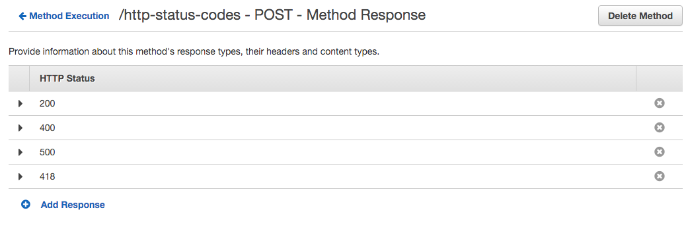
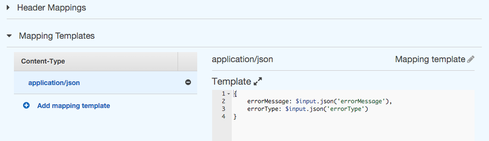

# Custom error codes with Lambda and API Gateway

Combining Amazon's Lambda and API Gateway is an effective means of creating a robust and cost effective api.

Lambda functions are passed a `context` object containing both a `succeed` and a `fail` method. Both methods are for returning a value from your lambda process, on success or failure. You might expect `failure` to send a response with a 4XX or 5XX status code, unfortunately you'd be wrong.

```js
exports.handler = function(event, context) {
   if (superAwesomeCode() === 'ok') {
     context.succeed('It worked!');
   } else {
     context.fail('There was an error')
   }
}
```

This is obviously not a very helpful response for our api consumers. Fortunately Amazon has provided a solution for this (if not a slightly unusual one - but one that does lets us achieve what we need).

### What do lambda error responses look like via the api gateway?

Lets have a look at how failure calls from Lambda are displayed. The simple lambda code below...
```js
exports.handler = function(event, context) {
  var error = new Error("Invalid data")
  context.fail(error)
}
```
...will result with the following response _(including the http status for clarity)_
```js
Status: 200
{
  "errorMessage": "Invalid data",
  "errorType": "Error",
  "stackTrace": [
    "exports.handler (/var/task/index.js:11:17)"
  ]
}
```
For interest the same can be achieved without using a real error object, by just calling ```context.fail("Invalid data")``` resulting in...
```js
Status: 200
{
  "errorMessage": "Invalid data"
}
```


### Specifying error codes

Our first step in achieving relevant http status codes back from our api is to tell the gateway each  code we wish to return.  From the method execution page of the API Gateway resource (below), select **Method Response** at the bottom right.


  
Simply click **Add response** for each of your desired status codes.



### Mapping error codes

Next let's map these status codes to our lambda responses within the gateway. Again from method execution select **Integration Response**.  We are able to specify a regex pattern on the lambda fail response and map that to a one of our status codes we created.  It's interesting to note (and somewhat frustrating) that the regex patters match against the returned ```errorMessage``` property (whether using an error object or a string), you are in fact not able to match against the actual error type (which might sound sensible).

Let's add the first response of 400 when invalid data is sent to our api as per the examples above.  Matching a regex against the errorMessage we can use  ```Invalid.*```


All failure calls with a message starting with "Invalid" will now return with a 400 status code.

```js
exports.handler = function(event, context) {
  var error = new Error("Invalid data")
  context.fail(error)
}
```

```js
Status: 400
{
  "errorMessage": "Invalid data",
  "errorType": "Error",
  "stackTrace": [
    "exports.handler (/var/task/index.js:11:17)"
  ]
}
```

It's up to you whether you prefix your error messages with predictable phrasing to match against a regex pattern, or use some more complicated regex patterns to match against a variety of responses.

A good approach after entering several status regex patterns is to map a final _catch all_ error response for all remaining failures (the API Gateway will return the first status code it matches against).

For the catch all error response the intuitive ```.*``` _(matching any character or nothing at all)_ will in fact match for even a ```context.succeed()```.  So instead we can use ```.+``` _(matching at least something)_ which will match for failure, but still return 200 as the default mapping for ```context.succeed()```.


```js
exports.handler = function(event, context) {
  var error = new Error("A different error")
  context.fail(error)
}
```
will result in the below with a status code of 500!
```js
Status: 500
{
  "errorMessage": "A different error",
  "errorType": "Error",
  "stackTrace": [
    "exports.handler (/var/task/index.js:11:17)"
  ]
}
```

### Response mapping templates
As a final touch let's remove the ```stackTrace``` property from our error response (as for api purposes it's more information than we may wish to provide).  One-by-one expand each regex to reveal **Mapping templates** and enter ```application/json``` (don't forget the little 'tick' to save). Clicking your newly created mapping template will show **Output passthrough** towards the right (which currently allows the full error response through).  Click the edit button next to it and select **Mapping template** from the dropdown. The below json will specify your output pulling in the original data from the response but omitting the stackTrace.

```json
{
    errorMessage: $input.json('errorMessage'),
    errorType: $input.json('errorType')
}
```



### That's it!

We've setup our error code status mappings and can now continue developing our api knowing our users will get useful responses.
